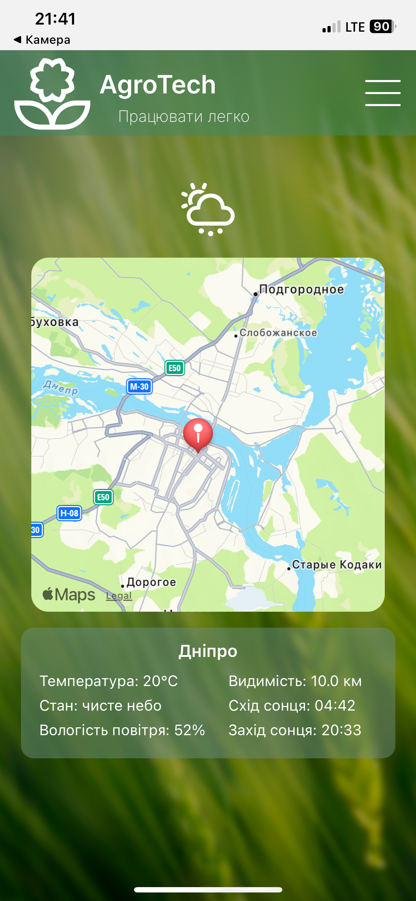

# 🌿 AgroTech — Smart Agriculture App

AgroTech is a mobile-first application built with React Native and Expo that helps Ukrainian farmers calculate crop needs, 
view weather data for specific locations, and save notes about planting strategies. Designed with simplicity, offline-first mindset, and fast access in mind.

---

## 📲 Features

- 🌦 **Weather forecast** based on geolocation or map selection
- 📍 **Interactive map** for checking weather by region
- 🌾 **Crop calculators** for area-based or crop-based planning
- 🧮 Save **calculation results to notes**
- 🔐 Firebase authentication for secure user access
- 📌 Ukrainian localization
- 📈 Dynamic recommendation panel
- ⚙️ Smooth integration with Expo Go — no build needed to preview

---

## 🛠️ Tech Stack

- **React Native (Expo)**
- **Firebase Auth + Firestore**
- **Google Geocoding API** *(used via `getCityNameByCoords`)*
- **OpenWeather API**
- **React Navigation (native-stack + tab-view)**
- **TypeScript**
- **react-native-maps**
- **react-native-svg**
- **react-native-modal**, **react-native-paper**, and more...

---

## 📷 Screenshots

#### Home

#### Calculator

#### Weather

---

## ⚙️ Setup Instructions

1. Clone the repo
2. Run `npm install`
3. Create `.env` file in root with the following:

OPENWEATHER_API_KEY=your_key_here
FIREBASE_API_KEY=your_key_here
FIREBASE_AUTH_DOMAIN=your_key_here
FIREBASE_PROJECT_ID=your_key_here
FIREBASE_STORAGE_BUCKET=your_key_here
FIREBASE_MESSAGING_SENDER_ID=your_key_here
FIREBASE_APP_ID=your_key_here
FIREBASE_MEASUREMENT_ID=your_key_here
GOOGLE_API_KEY=your_key_here

4. Install Expo CLI (if not installed): `npm install -g expo-cli`
5. Install Expo Go on your phone
6. Start the development server: `npx expo start`
7. Scan the QR code from your terminal/browser with the Expo Go app on your phone.

---

📄 License
This project is licensed under the MIT License — feel free to use and modify.